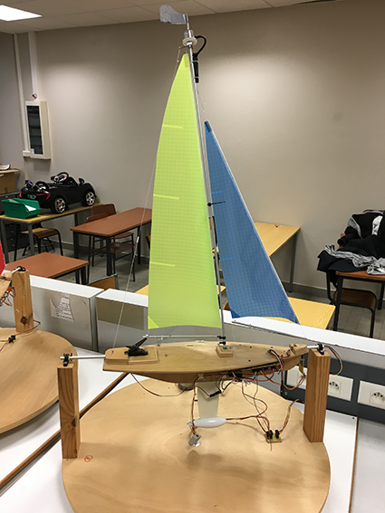

# Sailboat_Project

Remote-controlled sailboat

During this project we designed and developed an embedded software in the aim to control a model sailboat with a remote. We also implemented functions such as battery monitoring, boat rolling monitoring and sail sheeting depending on the wind angle. To do so, we worked with:
- A model sailboat made up with sensors (accelerometer, rotary/incremental encoder, HF receiver), actuators (servomotor, HF transmitter, DC motor) and different components (battery, remote, weathercock, sail).
- A microcontroller card build-in the model sailboat. This microcontroller was a STM32-H103 containing an ARM Cortex-M3 processor running up to 72MHz. 
- Keil µVision 4 to develop our embedded software in C and assembly language. 

The first step of our project was the design. We identified the mains actors and parameters of our system and for each component, we listed functions and peripherals they will need. The second phase was the embedded software development. The whole development has been made respecting the following software layer:

- Lower layer – drivers: development of peripherals sources code: ADC, Timer, GPIO, NVIC.
- Middle layer – services: development of components’ library using the driver layer: battery, DC motor, servomotor, weathercock, accelerometer.
- Upper layer – application: Implementation of the scheduler.

## Sailboat photo

