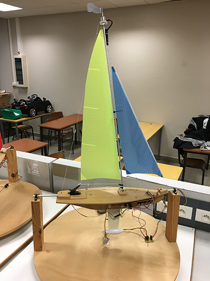

# Sailboat_Project

Voilier controlé par télécommande

Durant ce projet nous avons conçu un logiciel embarqué ayant pour but de controler un voilier de modélisme à l'aide d'une télécommande. Nous avons aussi implémenté des fonctions telles que la surveillance de la batterie, le contrôle du roulis du voilier et le bordage des voiles en fonction de l'angle du vent. Pour ce faire, nous avons travaillé avec : 

- un voilier de modélisme équipé de capteurs (accéléromètre, encodeur incrémental, récepteur HF), d'actionneurs (servomoteur, transmetteur HF, moteur à courant continu) et de différents composants (batterie, télécommande, voile, girouette).
- une carte microcontroleur insérée dans le voilier. Cette carte était une STM32-H103 contenant un processeur ARM Cortex-M3 d'une fréquence de 72MHz.
- le logiciel Keil µVision 4 pour développer notre logiciel embarqué en langage C et en assembleur.

La première étape de notre projet a été la conception. Nous avons identifié les principaux acteurs et paramètres de notre système et, pour chaque composant, nous avons listé les fonctions et les périphériques dont ils auront besoin. La seconde phase a été le développement de notre logiciel embarqué. L'intégralité du développement a été fait en respectant les couches logicielles suivantes :

- Couche inférieure - Pilotes/Drivers : développement des codes sources des périphériques : ADC, Timers, GPIO, NVIC.
- Couche médiane - Services : développement des librairies des composants du voilier en utilisant la couche pilote.
- Couche supérieure : implémentation de l'ordonnanceur.

Une photo de notre voilier est présente dans le dossier : 

